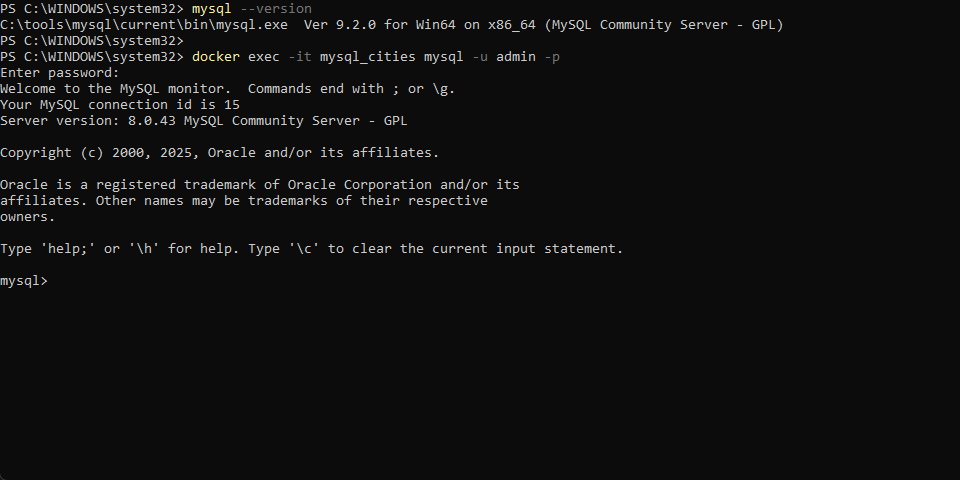
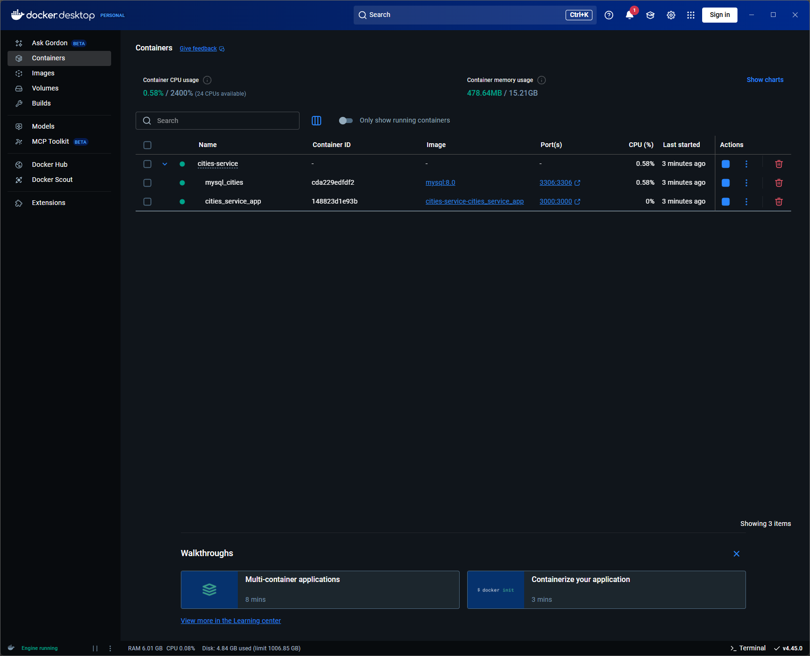
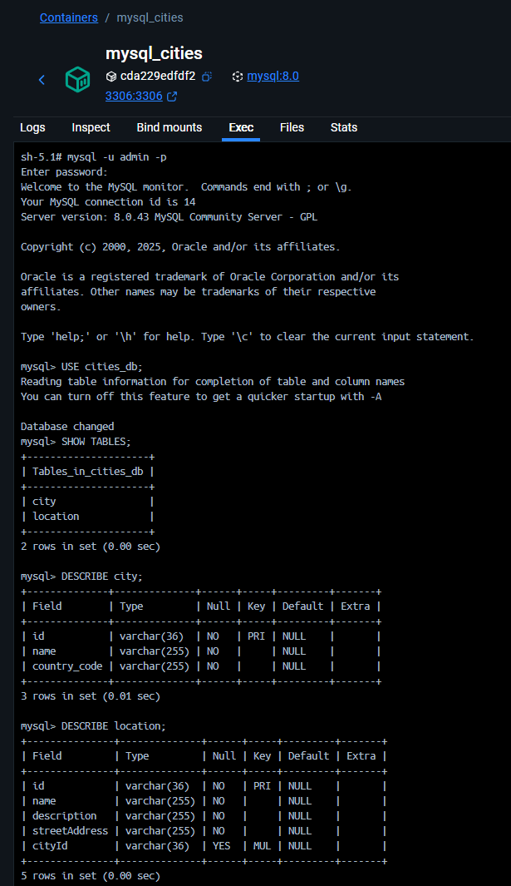
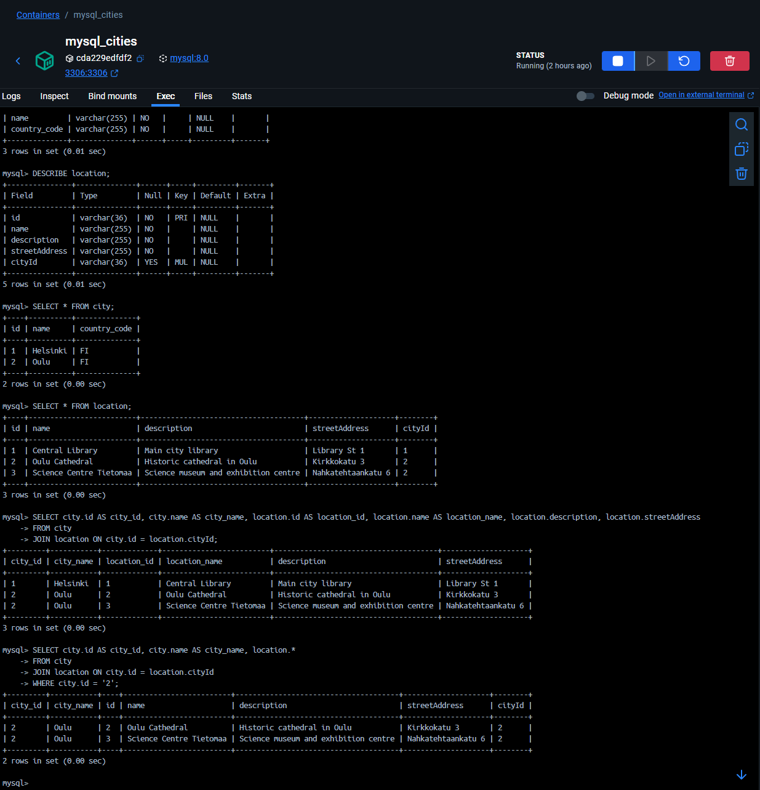

# Cities Service

NestJS REST & GraphQL API for managing cities and their locations, fully containerized with Docker.


## Features
- NestJS (TypeScript) backend
- MySQL database (Dockerized)
- GraphQL & REST endpoints
- Modular structure: Cities & Locations
- Easy local development with Docker Compose


## 🚀 Quick Start


### 1. Clone the repository
```bash
git clone https://github.com/FerhatArslann/cities-service.git
cd cities-service
```

### 2. Install dependencies
```bash
npm install
# If you see vulnerabilities, you can try:
npm audit fix
# Or, if needed (use with caution):
npm audit fix --force
```

### 3. (Optional, but recommended) Install NestJS CLI globally
```bash
npm i -g @nestjs/cli
```


### 4. Setup environment variables

Create a `.env` file in the project root:
```env
DB_HOST=mysql_cities
DB_HOST_PORT=3306
DB_USER=admin
DB_PASSWORD=password
DB_DATABASE=cities_db
PORT=3000
```


### 5. docker-compose.yml Overview

This project includes a `docker-compose.yml` file in the root directory. It defines two services:

- **cities_service_app**: The NestJS application container
- **mysql_cities**: The MySQL database container

The file also sets up the necessary environment variables, ports, and persistent storage for the database.


Below is the default `docker-compose.yml` configuration:

```yaml
version: '3.8'
services:
	mysql_cities:
		image: mysql:8.0
		container_name: mysql_cities
		restart: always
		environment:
			MYSQL_ROOT_PASSWORD: rootpassword
			MYSQL_DATABASE: cities_db
			MYSQL_USER: admin
			MYSQL_PASSWORD: password
		ports:
			- '3306:3306'
		volumes:
			- cities_service_db_data:/var/lib/mysql

	cities_service_app:
		build: .
		container_name: cities_service_app
		depends_on:
			- mysql_cities
		environment:
			DB_HOST: mysql_cities
			DB_HOST_PORT: 3306
			DB_USER: admin
			DB_PASSWORD: password
			DB_DATABASE: cities_db
		ports:
			- '3000:3000'
		command: npm run start:prod

volumes:
	cities_service_db_data:
```

---

**Security Note:**
- You should change the default passwords in your `.env` and `docker-compose.yml` files before deploying or sharing your project.
- For extra security, consider adding `.env` and/or `docker-compose.yml` to your `.gitignore` file so they are not included in your public repository.

### 6. Start Docker Compose in VS Code Terminal

In your VS Code terminal, from the project root, create and start the Docker containers:
```bash
docker-compose up --build
```

## 🏃‍♂️ Running the App


### Option 1: Run with Docker (using terminal)

1. To access your MySQL database inside the running container, use your terminal (e.g., bash, PowerShell, or CMD):
	```bash
	docker exec -it mysql_cities mysql -u admin -p
	# Enter password: password
	```




### Option 2: Run with Docker Desktop UI

- Open Docker Desktop
- Click **Containers** > **cities_service_app** > Start
- Click **Containers** > **mysql_cities** > Start




## 🗄️ Database Access

#### Accessing MySQL from Docker Desktop

1. Go to **Containers** > **mysql_cities** > **Exec**.
2. In the shell, type:
	```sh
	mysql -u admin -p
	```
	When prompted, enter your password (default: `password`).

#### Example MySQL commands:

```sql
USE cities_db;
SHOW TABLES;
DESCRIBE city;
DESCRIBE location;
```



#### Example MySQL commands:

```sql
SELECT * FROM city;
SELECT * FROM location;
```

```sql
SELECT city.id AS city_id, city.name AS city_name, location.id AS location_id, location.name AS location_name, location.description, location.streetAddress
FROM city
JOIN location ON city.id = location cityId;
```

```sql
SELECT city.id AS city_id, city.name AS city_name, location.*
FROM city
JOIN location ON city.id = location.cityId
WHERE city.id = '2';
```





## 🧪 Testing

Run tests with:
```bash
npm run test
npm run test:e2e
npm run test:cov
```

## License

MIT